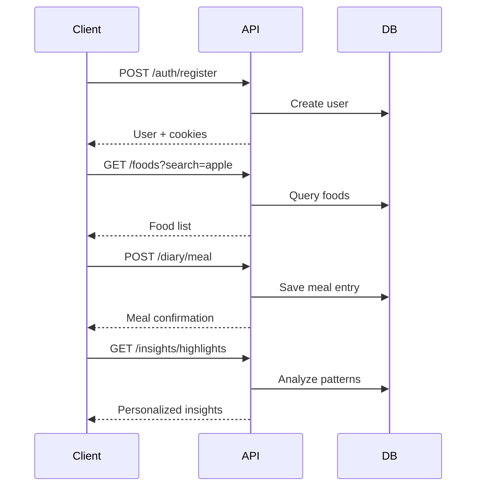

# Quick Start Guide

Get Ceboelha API up and running in minutes. This guide will take you from installation to making your first authenticated API call.

## Installation

<Steps>
  <Step title="Install Bun">
    Ceboelha requires [Bun](https://bun.sh) - a fast all-in-one JavaScript runtime.

    ```bash
    # macOS, Linux, and WSL
    curl -fsSL https://bun.sh/install | bash

    # Windows (PowerShell)
    powershell -c "irm bun.sh/install.ps1 | iex"
    ```

    Verify installation:

    ```bash
    bun --version
    ```
  </Step>

  <Step title="Clone & Install Dependencies">
    Clone the repository and install dependencies:

    ```bash
    git clone https://github.com/yourusername/ceboelha-api.git
    cd ceboelha-api
    bun install
    ```

    <Note>
      Using `bun install` instead of `npm install` is significantly faster.
    </Note>
  </Step>

  <Step title="Set Up MongoDB">
    Ceboelha requires MongoDB. Choose one option:

    **Option 1: Local MongoDB**

    ```bash
    # macOS (via Homebrew)
    brew install mongodb-community
    brew services start mongodb-community

    # Ubuntu/Debian
    sudo apt install mongodb
    sudo systemctl start mongodb
    ```

    **Option 2: Docker**

    ```bash
    docker run -d \
      --name mongodb \
      -p 27017:27017 \
      -e MONGO_INITDB_ROOT_USERNAME=admin \
      -e MONGO_INITDB_ROOT_PASSWORD=password \
      mongo:latest
    ```

    **Option 3: MongoDB Atlas (Cloud)**

    Sign up at [mongodb.com/cloud/atlas](https://www.mongodb.com/cloud/atlas) and create a free cluster.
  </Step>

  <Step title="Configure Environment">
    Copy the example environment file and configure it:

    ```bash
    cp .env.example .env
    ```

    Edit `.env` and set required values:

    ```bash .env
    # Server
    PORT=3333
    NODE_ENV=development

    # Database
    MONGODB_URI=mongodb://localhost:27017/ceboelha

    # JWT Secrets (IMPORTANT: Generate secure random strings!)
    # Generate with: openssl rand -hex 32
    JWT_ACCESS_SECRET=your-super-secret-access-key-at-least-32-characters-long
    JWT_REFRESH_SECRET=your-super-secret-refresh-key-at-least-32-characters-long
    JWT_ACCESS_EXPIRES_IN=15m
    JWT_REFRESH_EXPIRES_IN=7d

    # CORS
    CORS_ORIGIN=http://localhost:3000
    ```

    <Warning>
      **Never** commit your `.env` file! Use strong random secrets for production.
    </Warning>

    Generate secure JWT secrets:

    ```bash
    # Using openssl
    openssl rand -hex 32

    # Using Node.js
    node -e "console.log(require('crypto').randomBytes(32).toString('hex'))"
    ```
  </Step>

  <Step title="Seed the Database (Optional)">
    Populate the database with FODMAP food data:

    ```bash
    bun run db:seed-foods
    ```

    This imports 5000+ foods with FODMAP classifications.
  </Step>

  <Step title="Start the Server">
    Start the development server:

    ```bash
    bun run dev
    ```

    You should see:

    ```
    🧅 Ceboelha API starting...
    📍 Environment: development
    ✅ MongoDB connected successfully
    🚀 Server running at http://localhost:3333
    📚 Swagger docs at http://localhost:3333/docs
    💕 Made with love for Julia
    ```
  </Step>
</Steps>

## Your First API Call

Let's make your first authenticated API call!

<Steps>
  <Step title="Check Health Status">
    Verify the API is running:

    ```bash
    curl http://localhost:3333/health
    ```

    Response:

    ```json
    {
      "success": true,
      "status": "healthy",
      "timestamp": "2026-03-03T14:30:00.000Z",
      "version": "1.0.0",
      "environment": "development"
    }
    ```
  </Step>

  <Step title="Register a User">
    Create a new user account:

    ```bash
    curl -X POST http://localhost:3333/api/auth/register \
      -H "Content-Type: application/json" \
      -d '{
        "email": "user@example.com",
        "password": "SecurePass123!",
        "name": "John Doe"
      }'
    ```

    <Note>
      Password requirements:
      - Minimum 8 characters
      - At least 1 uppercase letter
      - At least 1 lowercase letter
      - At least 1 number
      - At least 1 special character
    </Note>

    Response:

    ```json
    {
      "success": true,
      "data": {
        "user": {
          "id": "65f1234567890abcdef12345",
          "email": "user@example.com",
          "name": "John Doe",
          "role": "user",
          "createdAt": "2026-03-03T14:30:00.000Z"
        },
        "expiresIn": 900
      },
      "message": "Conta criada com sucesso! 🐰"
    }
    ```

    <Warning>
      Tokens are sent via **httpOnly cookies** for security. You'll need to handle cookies in subsequent requests.
    </Warning>
  </Step>

  <Step title="Login">
    Authenticate with your credentials:

    ```bash
    curl -X POST http://localhost:3333/api/auth/login \
      -H "Content-Type: application/json" \
      -c cookies.txt \
      -d '{
        "email": "user@example.com",
        "password": "SecurePass123!"
      }'
    ```

    The `-c cookies.txt` flag saves cookies for future requests.
  </Step>

  <Step title="Search Foods">
    Search the FODMAP food database:

    ```bash
    curl http://localhost:3333/api/foods?search=banana&level=low \
      -b cookies.txt
    ```

    Response:

    ```json
    {
      "success": true,
      "data": [
        {
          "id": 1,
          "name": "Banana, common",
          "category": "Fruit",
          "fodmap": {
            "level": "low",
            "servingSize": "1 medium (100g)",
            "notes": "FODMAP free up to 1 medium banana"
          },
          "nutrition": {
            "energy": 89,
            "protein": 1.1,
            "carbs": 22.8,
            "fat": 0.3,
            "fiber": 2.6
          }
        }
      ],
      "pagination": {
        "total": 1,
        "page": 1,
        "limit": 50,
        "pages": 1
      }
    }
    ```
  </Step>

  <Step title="Log a Meal">
    Record a meal in your diary:

    ```bash
    curl -X POST http://localhost:3333/api/diary/meal \
      -H "Content-Type: application/json" \
      -b cookies.txt \
      -d '{
        "date": "2026-03-03",
        "meal": {
          "type": "breakfast",
          "time": "08:30",
          "foods": [
            {
              "foodId": 1,
              "name": "Banana, common",
              "servingSize": "1 medium",
              "servingAmount": 1
            }
          ],
          "notes": "Felt great after eating"
        }
      }'
    ```

    Response:

    ```json
    {
      "success": true,
      "data": {
        "id": "65f1234567890abcdef12346",
        "userId": "65f1234567890abcdef12345",
        "type": "meal",
        "date": "2026-03-03",
        "meal": {
          "type": "breakfast",
          "time": "08:30",
          "foods": [...],
          "notes": "Felt great after eating"
        },
        "createdAt": "2026-03-03T08:30:00.000Z"
      }
    }
    ```
  </Step>

  <Step title="Log a Symptom">
    Track IBS symptoms:

    ```bash
    curl -X POST http://localhost:3333/api/diary/symptom \
      -H "Content-Type: application/json" \
      -b cookies.txt \
      -d '{
        "date": "2026-03-03",
        "symptom": {
          "type": "bloating",
          "intensity": 2,
          "time": "10:30",
          "duration": 30,
          "notes": "Mild discomfort"
        }
      }'
    ```

    Symptom types: `bloating`, `pain`, `diarrhea`, `constipation`, `nausea`, `gas`, `other`
    
    Intensity scale: `1` (very mild) to `5` (very severe)
  </Step>

  <Step title="Get Insights">
    Retrieve personalized insights:

    ```bash
    curl http://localhost:3333/api/insights/highlights \
      -b cookies.txt
    ```

    Response:

    ```json
    {
      "success": true,
      "data": [
        {
          "type": "achievement",
          "title": "First Steps!",
          "message": "You logged your first meal. Keep it up!",
          "priority": 1
        },
        {
          "type": "tip",
          "title": "Stay Hydrated",
          "message": "Drinking water helps with IBS symptoms",
          "priority": 3
        }
      ]
    }
    ```
  </Step>
</Steps>

## Code Examples

Here are examples in different languages:

<CodeGroup>

```javascript JavaScript (fetch)
const API_URL = 'http://localhost:3333/api';

// Register
const registerResponse = await fetch(`${API_URL}/auth/register`, {
  method: 'POST',
  headers: { 'Content-Type': 'application/json' },
  credentials: 'include', // Important for cookies!
  body: JSON.stringify({
    email: 'user@example.com',
    password: 'SecurePass123!',
    name: 'John Doe'
  })
});

const { data } = await registerResponse.json();
console.log('User registered:', data.user);

// Search foods
const foodsResponse = await fetch(
  `${API_URL}/foods?search=banana&level=low`,
  { credentials: 'include' }
);

const foods = await foodsResponse.json();
console.log('Foods:', foods.data);
```

```python Python (requests)
import requests

API_URL = 'http://localhost:3333/api'
session = requests.Session()

# Register
response = session.post(f'{API_URL}/auth/register', json={
    'email': 'user@example.com',
    'password': 'SecurePass123!',
    'name': 'John Doe'
})

data = response.json()
print('User registered:', data['data']['user'])

# Search foods (cookies automatically included)
response = session.get(f'{API_URL}/foods', params={
    'search': 'banana',
    'level': 'low'
})

foods = response.json()
print('Foods:', foods['data'])
```

```typescript TypeScript (axios)
import axios from 'axios';

const api = axios.create({
  baseURL: 'http://localhost:3333/api',
  withCredentials: true, // Important for cookies!
});

// Register
interface RegisterResponse {
  success: boolean;
  data: {
    user: {
      id: string;
      email: string;
      name: string;
      role: string;
    };
    expiresIn: number;
  };
}

const { data } = await api.post<RegisterResponse>('/auth/register', {
  email: 'user@example.com',
  password: 'SecurePass123!',
  name: 'John Doe',
});

console.log('User registered:', data.data.user);

// Search foods
const foods = await api.get('/foods', {
  params: {
    search: 'banana',
    level: 'low',
  },
});

console.log('Foods:', foods.data.data);
```

```bash cURL
# Save cookies to file
COOKIE_FILE="cookies.txt"

# Register
curl -X POST http://localhost:3333/api/auth/register \
  -H "Content-Type: application/json" \
  -c $COOKIE_FILE \
  -d '{
    "email": "user@example.com",
    "password": "SecurePass123!",
    "name": "John Doe"
  }'

# Search foods (using saved cookies)
curl http://localhost:3333/api/foods?search=banana&level=low \
  -b $COOKIE_FILE

# Log a meal
curl -X POST http://localhost:3333/api/diary/meal \
  -H "Content-Type: application/json" \
  -b $COOKIE_FILE \
  -d '{
    "date": "2026-03-03",
    "meal": {
      "type": "breakfast",
      "time": "08:30",
      "foods": [
        {
          "foodId": 1,
          "name": "Banana",
          "servingSize": "1 medium",
          "servingAmount": 1
        }
      ]
    }
  }'
```

</CodeGroup>

## Common Workflows

### Complete User Journey



## Development Tips

<Note>
  **Hot Reload**: The `bun run dev` command watches for file changes and automatically restarts the server.
</Note>

### Testing with Swagger

Visit `http://localhost:3333/docs` for interactive API documentation:

1. Click **"Authorize"** button
2. Login via `/api/auth/login` endpoint
3. Test any endpoint directly from the browser

### Database Scripts

```bash
# Test MongoDB connection
bun run test:db

# Seed food database
bun run db:seed-foods

# Reset entire database (⚠️ destructive!)
bun run scripts/reset-database.ts
```

## Next Steps

<CardGroup cols={2}>
  <Card title="Authentication" icon="shield" href="/api/auth/register">
    Deep dive into JWT authentication
  </Card>
  
  <Card title="Foods API" icon="apple-whole" href="/api/foods/search-foods">
    Explore the FODMAP database
  </Card>
  
  <Card title="Diary Tracking" icon="book" href="/api/diary/create-meal">
    Learn about meal and symptom logging
  </Card>
  
  <Card title="Insights" icon="chart-line" href="/api/insights/highlights">
    Understand the analytics engine
  </Card>
</CardGroup>

## Troubleshooting

### MongoDB Connection Failed

```
❌ Error: MongoServerError: connect ECONNREFUSED
```

**Solution**: Ensure MongoDB is running:

```bash
# macOS
brew services start mongodb-community

# Linux
sudo systemctl start mongodb

# Docker
docker start mongodb
```

### Invalid JWT Secret

```
❌ JWT_ACCESS_SECRET must be at least 32 characters
```

**Solution**: Generate a secure secret:

```bash
openssl rand -hex 32
```

Paste the output into your `.env` file.

### Port Already in Use

```
❌ Error: listen EADDRINUSE: address already in use :::3333
```

**Solution**: Change the port in `.env` or kill the process:

```bash
# Find process using port 3333
lsof -ti:3333

# Kill it
kill -9 $(lsof -ti:3333)
```

## Need Help?

- Check the [API Reference](/api/auth/overview) for detailed endpoint documentation
- Visit `/docs` for interactive Swagger documentation
- Email: support@ceboelha.app